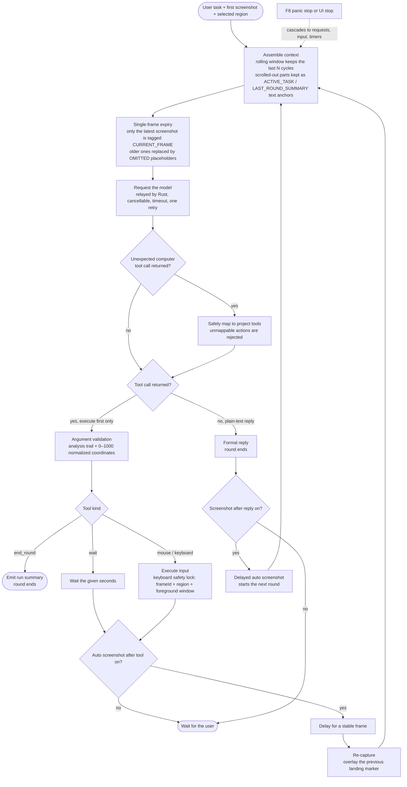

# VLM_Screenshot_Action

[](LICENSE)
[](https://www.microsoft.com/windows)
[](https://tauri.app)
[](https://github.com/s11IM/VLM_Screenshot_Action/actions/workflows/ci.yml)

[中文](README.md) | **English**

A lightweight vision-language model (VLM) screenshot action tool: select a screen region, the AI understands the frame, drives mouse and keyboard with normalized coordinates, and loops until the task is done. No API or accessibility interface is required from the target application.

## About This Project

A complete implementation shared publicly, but not one under continuous heavy iteration. It doubles as a design archive: it records the core logic chain and architectural tradeoffs of this visual control loop (observe → decide → act → calibrate → loop) for future review, reuse, or porting into other projects. The documentation therefore focuses on "why it was designed this way and what it costs", with feature reference as a secondary thread.

## Design Decisions and Tradeoffs

Presented in decision-chain order. Each entry explains why it was chosen and what it costs.

### 1. Pure vision + normalized coordinates, not UIA / DOM / accessibility APIs

- **Gain**: works across any software — games, emulators, and legacy apps alike; no interface required from the target program
- **Cost**: targeting accuracy is bounded by the model's vision (small buttons and low-contrast UI are hard); cannot control programs running with higher privileges (UAC)
- **Normalized coordinate space**: the model locates points on a 0–1000 relative plane (top-left `0,0`, bottom-right `1000,1000`), decoupled from resolution, window size, and DPI

### 2. Rolling context + single-frame upload, not accumulating every screenshot

- **Problem**: screenshots are token-expensive; accumulating them per round quickly blows the context window and budget
- **Approach**: keep only the most recent N observe-act cycles (`contextCycles`, 1–999); each request carries only the latest screenshot while historical ones are replaced with an `[IMAGE frame=OMITTED]` placeholder — token cost does not grow with rounds
- **Compensation**: information scrolled out of the window is not simply dropped — the active task (`ACTIVE_TASK`) and the previous round summary (`LAST_ROUND_SUMMARY`) are preserved as text anchors, so long tasks do not lose the goal
- **Cost**: the model loses long-term visual memory and can only fall back to text anchors; tasks that require looking back at much older frames do not fit

### 3. Mandatory per-step analysis, not bare tool calls

Every tool call must carry an `analysis` of ≤1000 characters (the reasoning for this step). It serves two purposes at once: an auditable decision trail, and the raw material for the summaries that survive the rolling window in decision 2.

### 4. Per-step self-calibration closes the feedback loop

The latest screenshot is overlaid with a red cross / drag trajectory marking the previous landing point. The model corrects drift from the gap between "expected landing point" and "actual screen change" — a mitigation for the cost accepted in decision 1.

### 5. Safety boundaries as a first-class design

| Mechanism | Effect |
|-----------|--------|
| F8 global panic stop | Holding F8 at any moment during keyboard input interrupts immediately; the stop latches and never auto-resumes |
| Keyboard safety lock | Keyboard actions require frameId, capture region, and foreground window to all match the latest capture; a capture older than 5 minutes or a changed foreground window aborts safely |
| Auto window evasion | The main window hides itself before capture and before actions — no occlusion, no focus stealing |
| Redacted logging | JSONL logs `[redact]` API keys, screenshot base64, and conversation content; 2MB rotation ×4 archives |
| Cancellation propagation | An interrupt cascades to in-flight API requests, input actions, and idle-loop timers; combo keys release in reverse order |

See [SECURITY.md](SECURITY.md) for details.

### 6. Tauri monolith + restrained dependencies

About 5,100 lines of source today (TypeScript ≈ 2,900 + Rust ≈ 2,200), no Electron / Node.js runtime bundling, standard NSIS / MSI installers. The frontend is just React + lucide icons; the Rust side is enigo + xcap + reqwest with no framework-level abstraction — the core logic stays readable and portable.

### Tool protocol

Seven OpenAI function-calling tools (click / drag / hover / keyboard_type / keyboard_press / wait / end_round); unexpected Anthropic-style `computer` tool calls are safely mapped automatically (pixel coordinates converted to 0–1000; unmappable actions are rejected).

---

## Quick Start

### Prerequisites

- Windows 10 / 11
- Node.js ≥ 24.12 and a stable Rust toolchain (for building)
- An API key for any OpenAI-compatible endpoint (the model must support vision)

### Build

```bash
git clone https://github.com/s11IM/VLM_Screenshot_Action.git
cd VLM_Screenshot_Action
npm ci
npm run tauri dev     # development
npm run tauri build   # installers land in src-tauri/target/release/bundle/
```

### First Run

1. **Configure the API**: open settings via the gear icon (top right), fill in API URL, API key, and model name
2. **Select a region**: click "Select capture region" and drag a rectangle over the target window on the screen overlay; Esc cancels
3. **Give a task**: describe the goal in the input box (e.g. "click the start button and open settings") and send
4. **Watch the loop**: the AI runs the capture → analyze → act → re-capture loop and can be interrupted at any time; for unattended runs enable "screenshot after reply" and switch to mini mode

---

## Tool Set

| Tool | Purpose | Key parameters |
|------|---------|----------------|
| `click` | Single / double click | `x, y` (0–1000), `clicks: 1\|2` |
| `drag` | Drag | `fromX, fromY, toX, toY` |
| `hover` | Hover (wait for tooltip) | `x, y` |
| `keyboard_type` | Type literal Unicode text | `text` (≤10000 chars), `intervalMs`, `submit` |
| `keyboard_press` | Physical keys / combos | `keys[]` (1–8), `holdMs` |
| `wait` | Wait for the screen to change | `seconds` (1–60) |
| `end_round` | End this run | `message` (summary for the user) |

---

## Configuration

| Setting | Default | Range / Notes |
|---------|---------|---------------|
| API URL | `https://api.openai.com/v1` | any OpenAI-compatible endpoint |
| Model | `gpt-4o-mini` | must support vision and function calling |
| Reasoning Effort | `low` | `low` / `high` / `xhigh`, passed through |
| Context cycles | `3` | 1–999, rolling window size |
| Delay after action | `7` s | 0.5–20 s, wait for a stable frame |
| Delay after reply | `15` s | 5–120 s, idle-loop interval |
| Request timeout | `60` s | 5–300 s |
| Retry on failure | on, 3 s apart | 0–15 s, at most one retry |
| Enable tools | on | off = conversation only |
| Auto screenshot after tool | on | off = manual screenshots drive the next round |

---

## Architecture

### Runtime Flow



### Module Map

```
┌────────────────────────── Frontend (React + TS) ──────────────────────────┐
│  App.tsx                  session/loop state machine, capture-act loop,   │
│                            retry and cancellation                          │
│  model.ts                 tool schemas, rolling-context assembly,          │
│                            single-frame expiry, argument validation       │
│  computerToolAdapter.ts   Anthropic computer tool calls → project tools   │
│  storage.ts               IndexedDB session persistence (15-day GC)       │
└──────────────────────────┬─────────────────────────────────────────────────┘
                        Tauri invoke
┌──────────────────────────▼─────────────────────────────────────────────────┐
│  src-tauri/lib.rs          capture (auto-hides main window), API relay     │
│                            (cancellable/timeout), keyboard safety lock,   │
│                            region selection, mini mode, redacted logging  │
│  desktop-core/             input primitives: SendInput absolute coords     │
│                            (virtual desktop), key parsing, interruptible  │
│                            hold/typing, DPI awareness                     │
└───────────────────────────────────────────────────────────────────────────┘
```

See [docs/architecture.md](docs/architecture.md) for module responsibilities and a reading order.

---

## Compatibility Notes

- The API layer depends only on the OpenAI-compatible `/chat/completions` format — OpenAI, Qwen, Zhipu GLM, DeepSeek, and aggregator gateways all work directly
- Some models (via compatibility gateways) return Anthropic-style `computer` tool calls; the adapter maps them safely:
  `screenshot→wait`, `left_click/double_click→click`, `mouse_move→hover`, `left_click_drag→drag`, `type→keyboard_type`, `key→keyboard_press`, with pixel coordinates converted to 0–1000 normalized; actions that cannot be mapped safely are rejected
- Multi-monitor and mixed-DPI setups are supported (including negative-coordinate secondary screens); the capture region must lie entirely within one monitor

## Known Limitations

1. Windows only (input and foreground-window detection rely on Win32 APIs)
2. Cannot control programs running with higher privileges (UAC boundary)
3. Exclusive fullscreen games should be switched to windowed / borderless
4. Targeting accuracy for small buttons and low-contrast UI depends on the model's vision
5. `keyboard_type` sends characters one by one — not suited for fast entry of very long texts

---

## Development

```bash
npm run check          # TS typecheck + frontend unit tests
npm run test:rust      # cargo test for desktop-core and src-tauri
npm run fmt:rust:check # Rust formatting check
npm run tauri dev      # dev mode
npm run package:public # build the portable archive
```

Runtime logs live in `vlm_screenshot_action.log` under the system application-log directory.

## Roadmap

- [ ] OCR text extraction to aid targeting

## License

[MIT](LICENSE)
