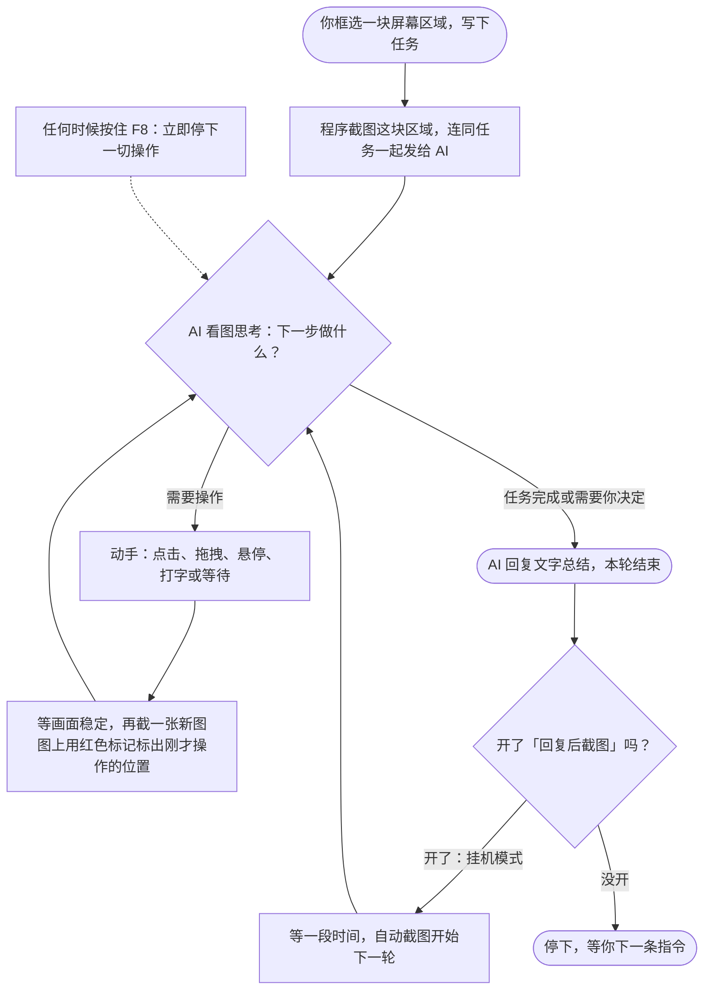

# VLM_Screenshot_Action

[](LICENSE)
[](https://www.microsoft.com/windows)
[](https://tauri.app)
[](https://github.com/s11IM/VLM_Screenshot_Action/actions/workflows/ci.yml)

**中文** | [English](README.en.md)

一个轻量级的视觉语言模型（VLM）截图操作工具：框选屏幕区域，AI 通过截图理解画面，用归一化坐标驱动键鼠，循环执行直到任务完成。无需目标软件提供任何 API 或无障碍接口。


## 设计决策与取舍

### 1. 纯视觉 + 归一化坐标，而不是 UIA / DOM / 无障碍 API

- **得到**：跨软件通用——游戏、模拟器、老软件一视同仁，不依赖目标程序暴露任何接口
- **代价**：定位精度受模型视觉能力限制（小按钮、低对比度 UI 会难），无法操作更高权限（UAC）程序
- **归一化坐标空间**：模型统一在 0–1000 的相对平面上定位（左上 `0,0`，右下 `1000,1000`），与分辨率、窗口大小、DPI 解耦

### 2. 滚动上下文 + 单帧发送，而不是累积全部截图

- **问题**：截图 token 成本高，逐轮累积很快撑爆上下文窗口和预算
- **做法**：仅保留最近 N 个「观察-操作」循环（`contextCycles`，1–999 可调）；每次请求只携带最新一张截图，历史截图替换为 `[IMAGE frame=OMITTED]` 占位符——token 消耗不随轮数累积
- **补偿**：滚出窗口的信息不直接丢弃——活跃任务（`ACTIVE_TASK`）与上一轮总结（`LAST_ROUND_SUMMARY`）以文本锚点保留，长任务不迷失目标
- **代价**：模型失去远期视觉记忆，只能靠文本锚点回溯；需要「回看很久之前画面」的任务不适用

### 3. 每步强制 analysis，而不是只回工具调用

每次工具调用都要求附带 ≤1000 字符的 `analysis`（本步依据）。它同时服务两个目的：决策留痕（可审计、可调试），以及滚动上下文滚出窗口后的摘要素材——第 2 条的文本锚点正是从这里提炼。

### 4. 每步自校准，闭合反馈环

截图上叠加红色十字 / 拖拽轨迹标记上一次落点。模型从「预期落点 vs 实际画面变化」的偏差中自我修正，补偿纯视觉定位的漂移——这是第 1 条取舍的缓解措施。

### 5. 安全边界作为一等设计

| 机制 | 作用 |
|------|------|
| F8 全局急停 | 键盘输入期间任何时刻按住 F8 立即中断，中断后锁存不自动恢复 |
| 键盘安全锁 | frameId、截图区域、前台窗口三者与最近一次截图完全一致才允许键盘操作；截图超 5 分钟或前台窗口变化即安全中断 |
| 窗口自动避让 | 截图与操作前主窗口自动隐藏，不遮挡画面、不抢焦点 |
| 脱敏日志 | JSONL 日志对 API Key、截图 base64、对话内容统一 `[redacted]`，2MB 自动轮转 ×4 |
| 取消传播 | 中断级联取消 API 请求、键鼠动作与挂机定时器，组合键按逆序释放 |

详见 [SECURITY.md](SECURITY.md)。

### 6. Tauri 单体 + 依赖克制

当前约 5,100 行源码（TypeScript ≈ 2,900 + Rust ≈ 2,200），无 Electron / Node.js 运行时捆绑，产物为标准 NSIS / MSI 安装包。前端仅 React + lucide 图标，Rust 侧 enigo + xcap + reqwest，无框架级抽象层——核心逻辑一览无余，方便阅读与移植。

### 工具协议

7 个 OpenAI function-calling 工具（click / drag / hover / keyboard_type / keyboard_press / wait / end_round）；对模型意外返回的 Anthropic `computer` 工具调用自动安全映射（坐标从像素换算为 0–1000，不可安全映射的动作直接拒绝）。

---

## 架构

### 核心流程



整个程序就是让 AI 反复做「看图 → 动手 → 再看图确认效果」这个循环，直到任务完成或你按停。每一步只把最新一张截图发给模型（旧图换成一行占位文字）来控制成本，内部机制见上面的设计取舍。

### 模块划分

```
┌──────────────────────────── 前端 (React + TS) ────────────────────────────┐
│  App.tsx                  会话/循环状态机、截图-执行闭环、重试与取消        │
│  model.ts                 工具 schema、滚动上下文组装、单帧过期、参数校验   │
│  computerToolAdapter.ts   Anthropic computer 工具调用 → 本项目工具映射     │
│  storage.ts               IndexedDB 会话持久化（15 天不活跃自动清理）      │
└──────────────────────────┬─────────────────────────────────────────────────┘
                        Tauri invoke
┌──────────────────────────▼─────────────────────────────────────────────────┐
│  src-tauri/lib.rs          截图（自动隐藏主窗）、API 转发（可取消/超时）、  │
│                            键盘安全锁、区域选择、迷你模式、脱敏日志        │
│  desktop-core/             输入原语：SendInput 绝对坐标（虚拟桌面）、      │
│                            按键解析、可中断的按住/打字、DPI 感知           │
└───────────────────────────────────────────────────────────────────────────┘
```

更详细的模块职责与阅读顺序见 [docs/architecture.md](docs/architecture.md)。

---

## 快速开始

### 前置要求

- Windows 10 / 11
- Node.js ≥ 24.12、Rust 稳定版工具链（构建用）
- 任一 OpenAI 兼容接口的 API Key（模型需具备视觉能力）

### 构建

```bash
git clone https://github.com/s11IM/VLM_Screenshot_Action.git
cd VLM_Screenshot_Action
npm ci
npm run tauri dev     # 开发调试
npm run tauri build   # 产出安装包于 src-tauri/target/release/bundle/
```

### 首次使用

1. **配置 API**：右上角齿轮进入设置，填写 API URL、API Key 与模型名
2. **框选区域**：点击「选择截图范围」，在屏幕遮罩上拖动框选目标窗口，Esc 取消
3. **下达任务**：输入框描述目标（如「点击开始按钮并进入设置」）后发送
4. **观察循环**：AI 自动执行 截图 → 分析 → 操作 → 再截图 的闭环，可随时中断；需要挂机时开启「回复后截图」并切到迷你模式

---

## 工具集

| 工具 | 用途 | 关键参数 |
|------|------|----------|
| `click` | 单击 / 双击 | `x, y`（0–1000），`clicks: 1\|2` |
| `drag` | 拖拽 | `fromX, fromY, toX, toY` |
| `hover` | 悬停（等待 tooltip） | `x, y` |
| `keyboard_type` | 输入字面 Unicode 文本 | `text`（≤10000 字符），`intervalMs`，`submit` |
| `keyboard_press` | 物理按键 / 组合键 | `keys[]`（1–8 个），`holdMs` |
| `wait` | 等待画面变化 | `seconds`（1–60） |
| `end_round` | 结束本轮运行 | `message`（给用户的总结） |

---

## 配置项

| 配置 | 默认值 | 范围 / 说明 |
|------|--------|-------------|
| API URL | `https://api.openai.com/v1` | 任意 OpenAI 兼容接口 |
| 模型 | `gpt-4o-mini` | 需支持 vision 与 function calling |
| Reasoning Effort | `low` | `low` / `high` / `xhigh`，透传给接口 |
| 上下文循环数 | `3` | 1–999，滚动窗口大小 |
| 操作后截图延迟 | `7` 秒 | 0.5–20 秒，等待画面稳定 |
| 回复后截图延迟 | `15` 秒 | 5–120 秒，挂机循环间隔 |
| 请求超时 | `60` 秒 | 5–300 秒 |
| 失败重试 | 开，间隔 3 秒 | 0–15 秒，最多重试一次 |
| 启用工具 | 开 | 关闭后仅纯对话 |
| 工具后自动截图 | 开 | 关闭后需手动截图驱动下一轮 |

---

## 兼容性说明

- 接口层只依赖 OpenAI 兼容的 `/chat/completions` 格式——OpenAI、通义千问、智谱 GLM、DeepSeek 及各类聚合网关均可直连
- 部分模型（经兼容网关时）会返回 Anthropic 风格的 `computer` 工具调用；适配器会将其安全映射：
  `screenshot→wait`、`left_click/double_click→click`、`mouse_move→hover`、`left_click_drag→drag`、`type→keyboard_type`、`key→keyboard_press`，坐标从像素换算为 0–1000 归一化，不可安全映射的动作会被拒绝
- 多显示器与混合 DPI 已适配（含负坐标副屏）；截图区域必须完整位于同一块显示器内

## 已知限制

1. 仅支持 Windows（输入与前台窗口检测依赖 Win32 API）
2. 无法操作以更高权限运行的程序（UAC 边界）
3. 独占全屏游戏建议改为窗口化 / 无边框
4. 小按钮、低对比度 UI 的定位精度取决于所用模型的视觉能力
5. `keyboard_type` 逐字符发送，不适合超长文本的高速录入

---

## 开发

```bash
npm run check          # TS 类型检查 + 前端单测
npm run test:rust      # desktop-core 与 src-tauri 的 cargo test
npm run fmt:rust:check # Rust 格式检查
npm run tauri dev      # 开发模式
npm run package:public # 打包便携版归档
```

运行日志位于系统应用日志目录下的 `vlm_screenshot_action.log`。

## 许可证

[MIT](LICENSE)
